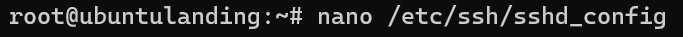

## Laporan Hasil Pratikum 2 - Sistem Administrasi Server 

Nadila Chusnul K - 1202190020 \
Anastasya Rahma Juniarti - 120219058\
Kelompok 10 

Masuk windows terminal dan konek menggunakan ssh
   
    
Cek lxc yang ada
 ```bash
    lcx-ls - f
 ```
   

Stop ubuntu landing dan ubuntu php7.4 karena akan dihapus/destroy
```bash
    lxc-stop -n ubuntu_landing
    lxc-stop -n ubuntu_pho7.4
 ```
 

Hapus clone terlebih dulu
```bash
    lxc-destroy ubuntu_landing_backup
    lxc-destroy ubuntu_landing
    lxc-destroy ubuntu_php7.4_backup
    lxc-destroy ubuntu_php7.4
 ```


Buat lxc ubuntu_landing focal dan ubuntu_php7.4 focal dan start kedua lxc
```bash
sudo lxc-create -n ubuntu_landing -t download -- --dist ubuntu --release focal --arch amd64 --force-cache --no-validate --server images.linuxcontainers.org
```


## 1. Rubah LXC landing dengan ubuntu focal (destroy n create, same ip, same name)
Masuk ubuntu landing dan setting ip
```bash
    lxc-attach ubuntu_landing
```

```bash
    nano /etc/netplan/10-lxc.yaml
```


Restart kemudian cek ip
```bash
    nano /etc/netplan/10-lxc.yaml
    netplan apply
    ip a
```

kemudain exit

Install ssh server 
```bash
    apt-get install openssh-server -y
```


Konfigurasi SSH
```bash
    nano /etc/ssh/sshd_config
```



Set password dan restart ssh
```bash
    service sshd restart
    passwd
```


Test SSH server
```bash
    ssh root@10.0.3.103
```


## 2. 2. Rubah LXC php7 dengan ubuntu focal (destroy n create, same ip, same name)

Masuk ubuntu_php7.4
```bash
    lxc-attach -n ubuntu_php7.4
```


Setting ip
```bash
    nano /etc/netplan/10-lxc.yaml
```


Restart agar ip terganti
```bash
    netplan apply
```


Install ssh server 
```bash
    apt install openssh-server 
```


konfig sshd
```bash
    nano /etc/ssh/sshd_config
```


Set password dan restart ssh
```bash
    service sshd restart
    passwd
```


Test ssh server
```bash
    ssh root@10.0.3.101
    lxc-ls -f
```


## 3. vm.local/

Buat file install Laravel
```bash
    nano install-laravel.yml
```


Buat direktori roles/php/tasks dan roles/php/handlers
```bash
    mkdir -p roles/php/tasks
    mkdir -p roles/php/handlers
```


Edit roles/php/tasks/main.yml
```bash
    nano roles/php/task/main.yml
```


Edit roles/php/handlers/main.yml
```bash
    nano roles/php/handlers/main.yml
```


Buat direktory roles/lv/tasks, roles/lv/templates, roles/lv/handlers
```bash
    mkdir -p roles/lv/tasks
    mkdir -p roles/lv/templates
    mkdir -p roles/lv/handlers
```


Edit roles/lv/tasks/main.yml
```bash
    mkdir -p roles/lv/tasks/main.yml
```


Edit roles/lv/templates/env.template
```bash
    nano roles/lv/templates/env.template
```


Edit roles/lv/templates/lv.conf
```bash
    nano roles/lv/templates/lv.conf
```


Edit roles/lv/handlers/main.yml
```bash
    nano roles/lv/handlers/main.yml
```


Run ansible dengan ansible-playbook -i hosts install-laravel.yml -k
```bash
    ansible-playbook -i hosts install-laravel.yml -k
```


Test laravel di browser
```bash
    vm.local
```


## 4.vm.local/blog

Buat ansible untuk mengintall wordpress lalu edit
```bash
    nano install-wp.yml
```


Buat direktory roles/wp/tasks, roles/wp/templates, roles/wp/handlers
```bash
    mkadir -p roles/wp/tasks  mkadir -p roles/wp templates
    mkadir -p roles/wp/handlers
```


Edit direktory roles/wp/tasks/main.yml
```bash
    nano roles/wp/tasks/main.yml
```


Edit roles/wp/templates/wp.conf
```bash
    nano roles/wp/templates/wp.conf
```


Edit roles/wp/templates/wp.local
```bash
    nano roles/wp/templates/wp.local
```


Edit roles/wp/handlers/main.yml
```bash
    nano roles/wp/handlers/main.yml
```


Run ansible install-wp.yml
```bash
    ansible-playbook -i hosts install-wp .yml -k
```


Test di browser
```bash
  vm.local/blog/wp-admin/install.php
```


## Soal Tambahan
5. Rubah konfigurasi php7.4 yang semula menggunakan socket menjadi menggunakan port (127.0.0.1:9001)

Untuk vm.local (laravel)
```bash
  nano roles/lv/templates/lv.conf
```


Untuk vm.local/blog (wordpress)
```bash
  nano roles/wp/templates/wp.local
```


Ecit /etc/php/7.4/fpm/www.conf
```bash
  nano /etc/php/7.4/fpm/www.conf
```


Run ansible Laravel
```bash
    ansible-playbook -i hosts install-laravel.yml -k
```


Test di browser
```bash
    vm.local
```


Run ansible wordpress
```bash
    ansible-playbook -i hosts install-wp.yml -k
```


Test di browser
```bash
    vm.local/blog
```
